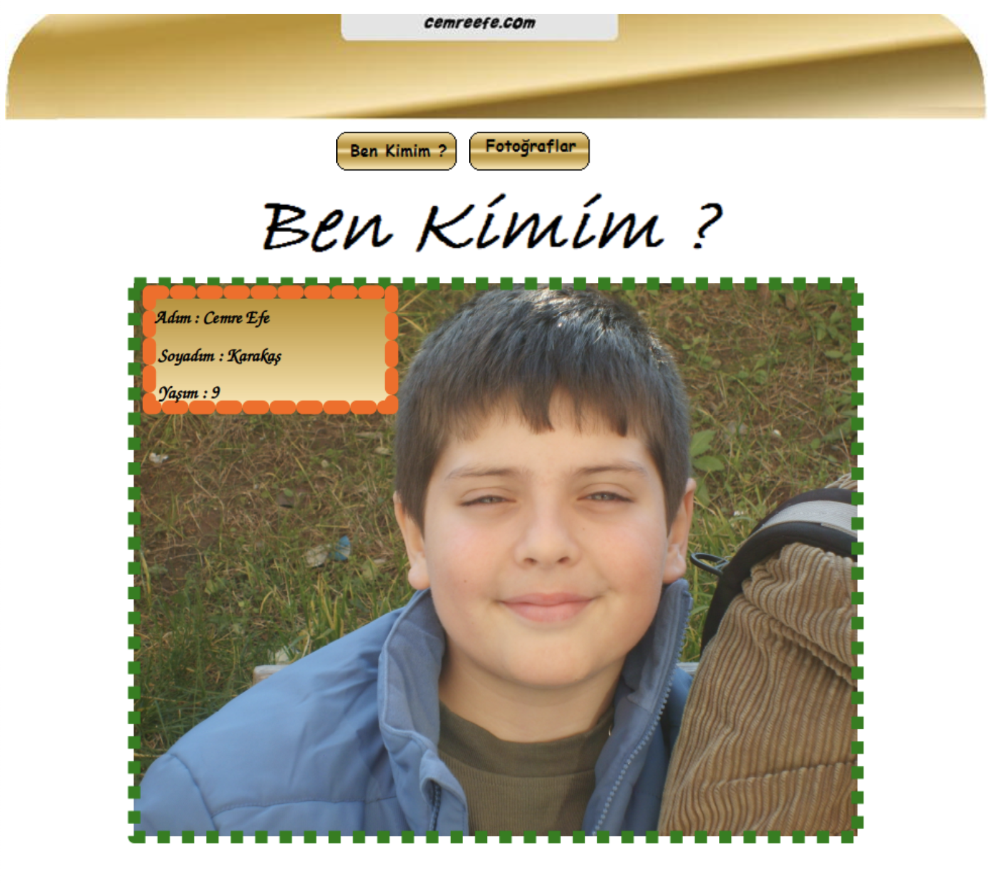
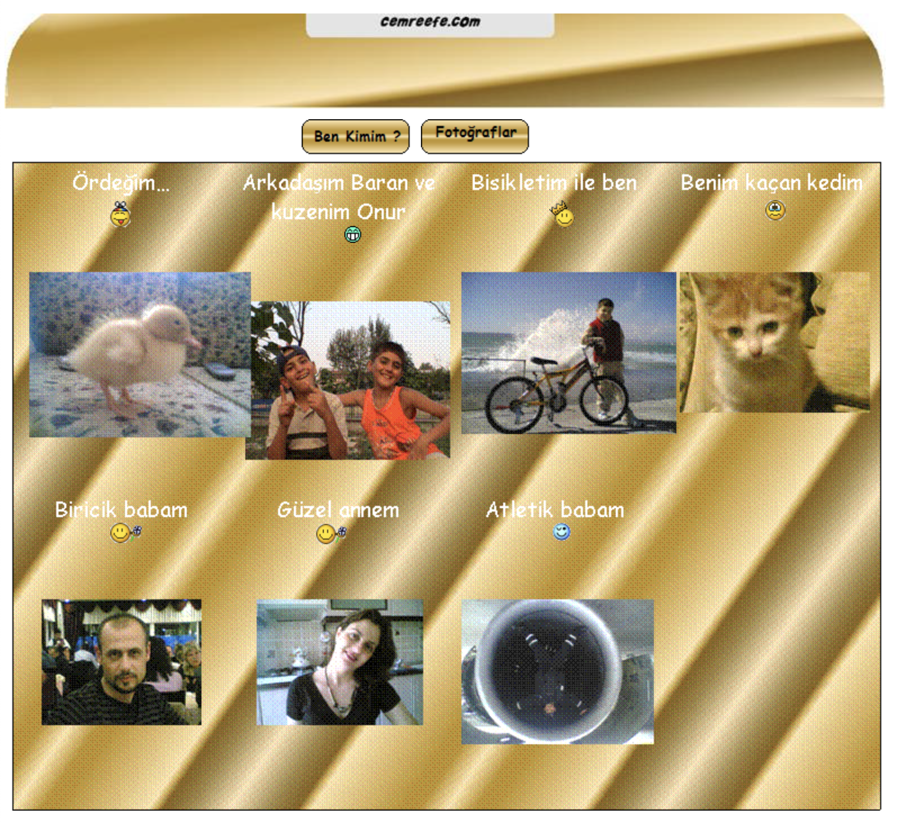

# cemreefe.com

## My personal website from the year 2007. 

The domain `cemreefe.com` was a new year's gift from my dad as I was very interested in programming.
A simple website with two pages, has a compelling frontend implementation consisting of absolutely positioned bmp files.
The artefacts inside the source files suggest I used the Microsoft Publisher 2003 on my dad's old PC.

See live on [cemrekarakas.com/2007](https://cemrekarakas.com/2007/cemreefe.htm).

## Screenshots

| | |
| - | - |
|   |  |